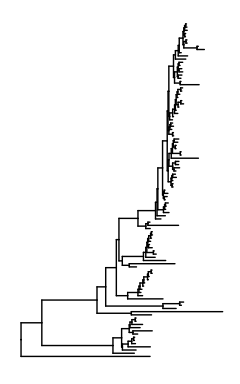
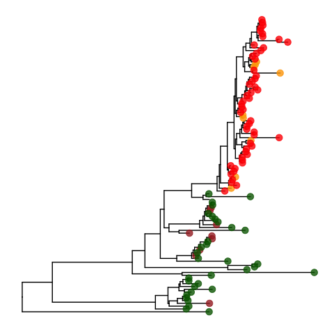
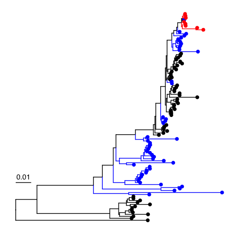

findtaxa
================

This is a function based on `ggtree` to edit the phylogenetic tree.

Example file
------------

A `Newick` format tree with tip names generally with host and subtype information. For other tree formats: [Tree Data Import](https://bioconductor.org/packages/devel/bioc/vignettes/ggtree/inst/doc/treeImport.html).

``` r
(((((((((((((((((((((('A/canine/Illinois/1619144/2015_H3N2_2015-04-14':8.3E-4,'A/canine/Georgia/95391/2015_H3N2_2015-07-13':5.4E-4):6.8E-4,'A/canine/Illinois/12191/2015_H3N2_2015-04-15':0.00169):5.4E-4,('A/canine/Illinois/0843093/2015_H3N2_2015-03-30':5.4E-4,'A/canine/Korea/0589318/2015_H3N2_2015-03-05':6.8E-4):5.4E-4):5.4E-4,(('A/canine/Indiana/96198/2015_H3N2_2015-07-02':0.00481,'A/canine/North_Carolina/109904/2015_H3N2_2015-07-29':8.3E-4):0.00873,('A/canine/Wisconsin/19137/2016_H3N2_2016-02-08':7.3E-4,'A/canine/Texas/343907/2015_H3N2_2015-12-22':6.3E-4):0.0014):5.7E-4):0.00247,'A/canine/Korea/BD-1/2013_H3N2_2013-05-30':0.00127):6.8E-4,'A/canine/Korea/DG1/2014_H3N2_2014-02-13':0.00619):0.00186,'A/canine/Korea/S1/2012_H3N2_2012-11-05':0.00684):0.00126,(((('A/feline/Korea/FY028/2010_H3N2_2010-10-15':0.00247,'A/canine/Korea/CY009/2010_H3N2_2010-10-15':0.00185):5.4E-4,('A/canine/Korea/CY005/2010_H3N2_2010-10-15':6.8E-4,'A/canine/Korea/CY001/2010_H3N2_2010-10-15':0.00244):5.4E-4):5.4E-4,('A/feline/Korea/FY029/2010_H3N2_2010-10-15':0.00184,'A/feline/Korea/FY027/2010_H3N2_2010-10-15':0.00246):5.0E-4):0.00185,('A/feline/Korea/02/2011_H3N2_2011-10-15':0.01252,'A/canine/Korea/KRIBB01/2011_H3N2_2011-11-01':5.4E-4):0.0037):6.9E-4):0.00308,(((((((('A/canine/Beijing/305/2009_H3N2_2009-12-13':6.8E-4,'A/canine/Beijing/295/2009_H3N2_2009-12-14':0.00126):0.00186,'A/canine/Beijing/418/2010_H3N2_2010-01-08':0.00126):5.4E-4,'A/canine/Beijing/253/2009_H3N2_2009-12-09':5.4E-4):5.9E-4,(('A/canine/Beijing/362/2009_H3N2_2009-12-17':0.00186,'A/canine/Beijing/420/2010_H3N2_2010-01-08':6.8E-4):0.00177,'A/canine/Beijing/364/2009_H3N2_2009-12-17':5.3E-4):0.00126):5.3E-4,'A/canine/Beijing/359/2009_H3N2_2009-12-17':5.4E-4):5.3E-4,'A/canine/Beijing/511/2010_H3N2_2010-01-03':0.00212):0.00126,'A/canine/Beijing/1028/2010_H3N2_2010-02-02':5.4E-4):0.00198,'A/canine/Jiangsu/06/2010_H3N2_2010-06-15':0.00186):5.4E-4):5.4E-4,((('A/canine/Liaoning/1585/2010_H3N2_2010-04-06':0.00184,'A/canine/Liaoning/1578/2010_H3N2_2010-04-06':0.00127):5.4E-4,'A/canine/Zhejiang/1/2010_H3N2_2010-09-30':0.00126):6.8E-4,('A/feline/Korea/01/2010_H3N2_2010-03-15':6.8E-4,'A/feline/Korea/01/2010_H3N2_a_2010-03-15':5.4E-4):0.00246):5.4E-4):5.4E-4,(((((('A/canine/Liaoning/27/2012_H3N2_2012-04-11':5.4E-4,'A/canine/Heilongjiang/L1/2013_H3N2_2013-03-10':6.8E-4):0.00126,('A/canine/Guangdong/05/2011_H3N2_2011-02-15':0.00244,'A/canine/Nanjing/11/2012_H3N2_2012-11-15':0.00308):5.4E-4):5.4E-4,('A/canine/Guangdong/12/2012_H3N2_2012-09-15':5.4E-4,'A/canine/Guangdong/23/2012_H3N2_2012-09-18':5.4E-4):0.00519):8.0E-4,'A/canine/Guangdong/04/2011_H3N2_2011-02-15':0.01795):0.0015,(('A/canine/Guangdong/1/2011_H3N2_2011-02-15':0.00127,'A/canine/Guangdong/3/2011_H3N2_2011-03-15':0.00372):8.7E-4,('A/canine/Guangdong/2/2011_H3N2_2011-02-15':0.00206,'A/feline/Heilongjiang/ZH/2014_H3N2_2014-02-17':0.00227):0.00186):0.00241):5.4E-4,((('A/canine/Jiangsu/01/2009_H3N2_2009-12-15':0.00246,'A/canine/Jiangsu/02/2010_H3N2_2010-03-15':0.00185):5.4E-4,'A/canine/Jiangsu/03/2010_H3N2_2010-04-15':6.8E-4):5.4E-4,('A/canine/Jiangsu/05/2010_H3N2_2010-05-15':6.8E-4,'A/canine/Jiangsu/04/2010_H3N2_2010-05-15':6.8E-4):6.8E-4):0.00186):6.3E-4):0.00308,(('A/canine/Korea/1/2010_H3N1_2010-02-05':5.4E-4,'A/canine/Korea/01/2007_H3N2_2007-05-15':0.00185):6.8E-4,('A/canine/Korea/MV1/2012_H3N2_2012-11-07':0.00247,'A/canine/Korea/VC378/2012_H3N2_2012-03-13':5.4E-4):5.4E-4):5.0E-4):0.00312,((('A/canine/Guangdong/2/2007_H3N2_2007-10-18':5.0E-4,'A/feline/Guangdong/1/2011_H3N2_2011-08-10':0.00185):5.4E-4,'A/canine/Guangdong/1/2007_H3N2_2007-04-18':6.8E-4):7.4E-4,'A/canine/Guangdong/2/2006_H3N2_2006-08-15':0.00363):0.00372):5.4E-4,'A/feline/Guangdong/1/2012_H3N2_2012-11-15':0.00547):0.00101,'A/canine/Guangdong/1/2006_H3N2_2006-06-15':0.00355):0.01161,(('A/duck/Korea/U14-2/2007_H3N2_2007-05-15':0.02024,'A/duck/Korea/JS53/2004_H3N2_2004-12-05':0.0013):0.00141,'A/aquatic_bird/Korea/JN-2/2006_H3N2_2006-99-99':0.00289):0.00518):0.01259,(((((((('A/duck/Korea/LPM66/2006_H3N2_2006-99-99':6.8E-4,'A/duck/Korea/LPM56/2005_H3N2_2005-99-99':5.4E-4):5.4E-4,'A/chicken/Korea/LPM67/2006_H3N2_2006-99-99':5.4E-4):0.00126,'A/chicken/Korea/LPM61/2005_H3N2_2005-99-99':0.00126):6.8E-4,('A/duck/Korea/LPM36/2005_H3N6_2005-99-99':0.00245,'A/duck/Korea/LPM38/2005_H3N6_2005-99-99':6.8E-4):5.4E-4):5.4E-4,('A/duck/Korea/LPM91/2006_H3N2_2006-99-99':0.00185,'A/duck/Korea/LPM92/2006_H3N2_2006-99-99':5.4E-4):0.00431):7.1E-4,'A/chicken/Korea/LPM88/2006_H3N2_2006-99-99':0.00618):0.00155,'A/duck/Korea/U14-1/2007_H3N2_2007-05-15':0.01471):0.01399,('A/chicken/Korea/S6/03_H3N2_2003-99-99':0.00476,'A/duck/Korea/U2-5/2007_H3N8_2007-05-01':0.0302):0.00461):0.00222):0.00173,((((((((('A/chicken/Korea/LPM43/2005_H3N2_2005-99-99':6.7E-4,'A/chicken/Korea/LPM44/2005_H3N2_2005-99-99':5.4E-4):0.00185,'A/duck/Korea/LPM22/2005_H3N2_2005-99-99':5.4E-4):5.4E-4,'A/duck/Korea/LPM23/2005_H3N2_2005-99-99':5.4E-4):0.00245,'A/duck/Korea/LPM18/2004_H3N2_2004-99-99':5.4E-4):6.8E-4,'A/chicken/Korea/LPM17/2004_H3N2_2004-99-99':5.4E-4):0.00185,'A/duck/Korea/LPM01/2004_H3N2_2004-99-99':0.00126):6.8E-4,'A/chicken/Korea/LPM03/2004_H3N2_2004-99-99':0.00126):6.8E-4,'A/duck/Korea/LPM09/2004_H3N2_2004-99-99':0.00307):0.0068,'A/duck/Korea/LPM86/2006_H3N2_2006-99-99':0.02334):0.0075):0.00704,(('A/duck/Korea/HP69/2007_H3N6_2007-11-29':0.00113,'A/duck/Korea/HP68/2007_H3N6_2007-11-30':0.0026):0.01106,'A/duck/Korea/U10-2/2007_H3N6_2007-05-09':0.00872):0.03788):0.00576,('A/duck/Korea/U12/2007_H3N2_2007-05-10':0.01335,'A/duck/Korea/A122/10_H3N6_2010-11-15':0.06043):0.02272):0.03652,(((((('A/muscovy_duck/Vietnam/LBM189/2012_H3N2_2012-99-99':5.4E-4,'A/muscovy_duck/Vietnam/LBM201/2012_H3N2_2012-07-11':5.4E-4):0.00219,'A/muscovy_duck/Vietnam/LBM437/2013_H3N8_2013-06-05':0.00705):0.00126,'A/duck/Vietnam/LBM211/2012_H3N8_2012-07-11':0.00666):5.3E-4,('A/muscovy_duck/Vietnam/LBM115/2012_H3N2_2012-07-11':0.00313,'A/duck/Hunan/S1824/2012_H3N8_2012-03-24':0.01275):0.00246):0.00501,(((('A/duck/Zhejiang/D1-1/2013_H3N6_2013-11-14':5.4E-4,'A/duck/Zhejiang/D1-3/2013_H3N6_2013-11-14':6.8E-4):0.00126,'A/duck/Anhui/D293/2014_H3N2_2014-02-04':0.00248):0.00238,'A/chicken/Guangdong/G1863/2014_H3N0_2014-04-16':0.01468):0.00375,'A/duck/Zhejiang/5/2011_H3N3_2011-06-15':0.00899):5.3E-4):0.00574,'A/duck/Shanghai/SH1/2013_H3N2_2013-04-26':0.01411):0.04708):0.01376,'A/duck/Vietnam/OIE-2382/2009_H3N2_2009-99-99':0.08538);
```

Function
--------

``` r
findtaxa <- function(type, 
                     tree, 
                     targetid, 
                     target){
  
  # type 1 = branch coloring 
  # type 0 = tip shape
  # default branch color = black
  
  library(ape)
  library(ggtree)
  
  # extract tree data
  tree.d <- fortify(tree)
  tree.d[, ncol(tree.d) + 1] <- gsub("'", "", tree.d$label)
  colnames(tree.d)[ncol(tree.d)] <- "taxaid"
  
  # for tip shape
  if (type == 0){
    
    shapetaxa <- data.frame(node = c(1:length(tree.d$isTip)), shapee = NA)
    
    for (i in 1: length(targetid)){
      
      shapetaxa$shapee[ grep(targetid[i], tree.d$taxaid) ] <- target[i]
      
    }
    
    return(shapetaxa)
    
    # for branch colorring     
  }else {
    
    # new column
    
    tree.d[, ncol(tree.d) + 1] <- "black"
    colnames(tree.d)[ncol(tree.d)] <- "colorr"
    
    # for branch extension
    
    edgematrix <- as.matrix(tree.d[,c(2,1)])
    
    # color grouping 
    
    group_color <- unique(target)
    
    for (i in 1: length(group_color)){
      
      # color as group to combine key word to targetno
      
      sub_color <- which(target == group_color[i])
      targetno <- c()
      
      for (t in 1: length(sub_color)){
        
        targetno <- unique( c(targetno, grep( targetid[ sub_color[t] ], tree.d$taxaid)) )
        
      }
      
      tobecolor = c()
      pre_targetno = length(targetno)
      post_targetno = 0
      
      # while loop 
      
      while( pre_targetno != post_targetno ){
        
        pre_targetno = length(targetno)
        
        for(k in 1:length(targetno)){
          
          # all sibiling 
          sibs <- edgematrix[
            which(edgematrix[,1] == 
                    edgematrix[which(edgematrix[,2] == targetno[k]),][1]),][,2]
          
          if (length(sibs) == 1){
            
            targetno = c(targetno, edgematrix[which(edgematrix[,2] == targetno[k]),][1])
            
          }else{
            
            if (length(which(sibs %in% targetno == "FALSE")) == 0){
              
              tobecolor = c(edgematrix[which(edgematrix[,2] == targetno[k]),][1], tobecolor)
              
              targetno = c(targetno, edgematrix[which(edgematrix[,2] == targetno[k]),][1])
            }
            
          }
          targetno = unique(targetno)
          tobecolor = unique(c(targetno, tobecolor))
        }
        
        post_targetno = length(targetno)
        
      }
      
      # coloring
      
      tree.d$colorr[tobecolor] <- group_color[i]
      
    }
    return(tree.d)    
    
  }
  
}
```

Imput tree file and build the tree
----------------------------------

We need three R packages: `stringr`, `ggtree`, `ape`.

``` r
library(stringr)
library(ape)
library(ggtree)
```

**H3** is directly copied from the above and paste in a text file.

``` r
treefile <- read.tree("./H3")
   tree0 <- ggtree(treefile)
```

``` r
tree0
```



Create accessory data
---------------------

### color the *tip* only

Prepare 2 vectors containing the keywords in tip names and corresponding colors.

``` r
     keyword <- c("canine", "feline", "duck", "chicken")
coloryouwant <- c("red", "orange", "darkgreen", "brown") 
```

Then use the function `findtaxa` with `type = 0`.

``` r
dataforannotate <- findtaxa(type = 0, 
                            tree = treefile, 
                            targetid = keyword,
                            target = coloryouwant)
```

Modify the tree with `%<+%`

``` r
tiptree <- tree0 %<+% dataforannotate + 
  geom_tippoint(aes(color = I(shapee)), size = 3, alpha = 0.8)
```

``` r
tiptree
```

    ## Warning: Removed 1 rows containing missing values (geom_point_g_gtree).



The Warning message from one tip name with "bird".

### color the *branch*

Prepare the same stuffs as previously: 2 vectors for **keyword** and **color**; **findtaxa** (this time `type = 1`) and `%<+%` (but with `aes()`, not `geom_tippoint()`.

``` r
     keyword <- c("Wisconsin", "Texas", "Illinois", "Georgia", "North_Carolina", "Indiana", "Korea")
coloryouwant <- c( rep("red", 6) , "blue") 
```

``` r
dataforannotate <- findtaxa(type = 1, 
                            tree = treefile, 
                            targetid = keyword,
                            target = coloryouwant)
```

``` r
branchtree <- tree0 %<+% dataforannotate + aes(color = I(colorr)) + 
  geom_tippoint(size = 2) + geom_treescale(x = 0, y = 20, offset = 3)
```

``` r
branchtree
```



Notes
-----

*colorr* and *shapee* are meaningless column names for the dataforannotate.
